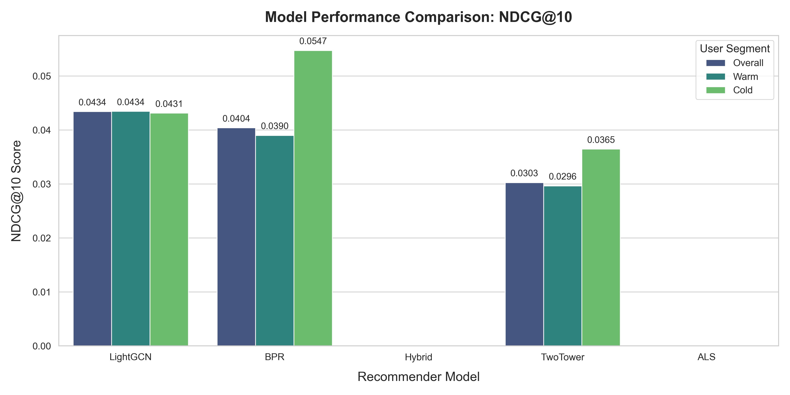

# DataFlix — Large-Scale Recommendation Systems Pipeline

A large-scale recommendation pipeline built on the MovieLens-32M dataset enriched with TMDB and IMDb metadata, combining collaborative filtering, graph learning, semantic embeddings, and ranking-aware optimization. The pipeline is optimized to train large sparse recommendation graphs efficiently on consumer-grade hardware (6GB VRAM).

---

## What it does

* **Predicts user preferences** using a blend of collaborative and content-based filtering.
* **Handles sparse-user and cold-start recommendation scenarios** using SBERT semantic embeddings.
* **Benchmarks multiple paradigms:** Matrix Factorization (ALS), Bayesian Personalized Ranking (BPR), EA Two-Tower Retrieval, LightGCN, EASE$^\text{R}$ and Hybrid models.
* **Evaluates ranking quality** using Recall@K and NDCG@K.
* **Implements $\mathcal{O}(1)$ inference caching** via precomputed NumPy arrays, reducing evaluation bottlenecks for 190K+ users to instant vector dot-products. 
* **Engineers CPU-graph offloading** to train 60M+ edge networks efficiently within a strict 6GB VRAM constraint.

---

## How it works

### Matrix Factorization (ALS)
Approximates the user-item interaction matrix:
$$\hat{r}_{ui} = \mu + b_u + b_i + p_u^T q_i$$
Where $p_u$ and $q_i$ are latent vectors, and $b_u, b_i$ are learned biases.

### Bayesian Personalized Ranking (BPR)
Optimizes pairwise ranking quality instead of explicit rating prediction, encouraging observed interactions to rank above sampled negatives:
$$L = -\log \sigma(\hat{r}_{ui} - \hat{r}_{uj})$$

### LightGCN
Learns embeddings through linear propagation over the bipartite interaction graph, capturing higher-order collaborative relationships without handcrafted features:
$$\mathbf{E}^{(k+1)} = \hat{A}\mathbf{E}^{(k)}$$

### Two-Tower Retrieval
A purely semantic dual-encoder architecture. The Item Tower encodes SBERT plot descriptions and IMDb genres, while the User Tower encodes chronological watch history, enabling zero-shot cold-start recommendations.

### EASE$^\text{R}$ (Embarrassingly Shallow AutoEncoders)
A closed-form linear autoencoder that learns a full-rank item-item weight matrix $B$ to reconstruct the user-item interaction matrix $X$. It enforces a strict zero-diagonal constraint ($\text{diag}(B) = 0$) so an item cannot predict itself:
$$B = I - P \cdot \text{diag}(P)^{-1} \quad \text{where} \quad P = (X^T X + \lambda I)^{-1}$$
By bypassing gradient descent and directly computing the regularized inverse of the item-item Gram matrix, it acts as a mathematically optimal, highly efficient collaborative filter for sparse datasets.

### Hybrid Model
Initializes using pre-computed collaborative factors (BPR/ALS) and dynamically fuses them with content-based semantic representations (SBERT/Metadata) through dense MLP layers. It bridges the gap between behavioral memorization and text-based generalization.

### Semantic Item & User Embeddings
* **Movie Representations:** Combines latent MF vectors, SBERT plot embeddings, genre encodings, and popularity features.
* **User Representations:** Combines collaborative latent vectors, aggregated watch-history embeddings, and behavioral statistics.

---

## Final Evaluation Results

| Model | Overall NDCG@10 | Warm User NDCG | Cold User NDCG |
| :--- | :--- | :--- | :--- |
| **EASR** | **0.0891** | **0.0901** | **0.0789** |
| **LightGCN** | 0.0434 | 0.0434 | 0.0431 |
| **BPR** | 0.0404 | 0.0389 | 0.0547 |
| **Hybrid** | 0.0481 | 0.0476 | 0.0529 |
| **Two-Tower** | 0.0302 | 0.0296 | 0.0364 |
| **ALS** | 0.0001 | 0.0001 | 0.0000 |

**Observations:**
* **EASE^R** (Embarrassingly Shallow AutoEncoders for Sparse Data) dominated the benchmark with a staggering 105% improvement over LightGCN, achieving an overall NDCG@10 of 0.0891. By bypassing gradient descent and directly computing the regularized inverse of the item-item Gram matrix, it proved that a full-rank, closed-form linear autoencoder can vastly outperform complex neural architectures on sparse collaborative tasks.  
* **Hybrid** successfully bridged the gap between behavioral and semantic architectures, outperforming both pure collaborative models (BPR) and graph models (LightGCN) with an overall NDCG@10 of 0.0481 by dynamically fusing behavioral memorization with SBERT metadata.  
* **LightGCN** achieved strong ranking quality (0.0434) through multi-hop collaborative propagation, proving highly effective for warm users before being dethroned by the hybrid and autoencoder architectures.  
* **BPR** remains a highly competitive, computationally lightweight baseline, remarkably maintaining its strongest performance (0.0547) on cold-start users.  
* **Semantic retrieval models** (Two-Tower) generalize much better for cold-start users and unseen items, outperforming their own warm-user metrics without relying on any historical interaction IDs.  



---

## Tech Stack

| Area | Tools & Libraries |
| :--- | :--- |
| **Core ML** | PyTorch, NumPy, SciPy, Torch Sparse |
| **NLP** | SentenceTransformers (SBERT) |
| **Data Processing** | Pandas, scikit-learn |

---

## Running the Pipeline

```bash
# 1. Preprocess Data & Build Graphs
python scripts/preprocess.py

# 2. Train Models
python scripts/train.py

# 3. Evaluate Ranking Metrics
python scripts/evaluate.py
```

---

 ## Setup

```
git clone https://github.com/AceAryan/dataflix.git
cd dataflix
python -m venv .venv
source .venv/bin/activate # macOS/Linux
.venv\Scripts\activate # Windows (Command Prompt / PowerShell)
pip install -r requirements.txt
```

> Raw datasets are not included. Download links and instructions in `data/README.md`.

---

## Project Structure

```
dataflix/
├── data/
│   ├── raw/               # Downloaded datasets (not committed)
│   └── processed/         # Sparse matrices and tensor caches
├── src/
│   ├── models/            # EASR, LightGCN, BPR, TwoTower, Hybrid, ALS
│   ├── data/              # Preprocessing and embedding modules
│   └── config.py
├── scripts/               # Training and evaluation pipeline
│   ├── preprocess.py
│   ├── train.py
│   └── evaluate.py
├── results/               # Checkpoints and evaluation reports (ignored)
└── tests/

```